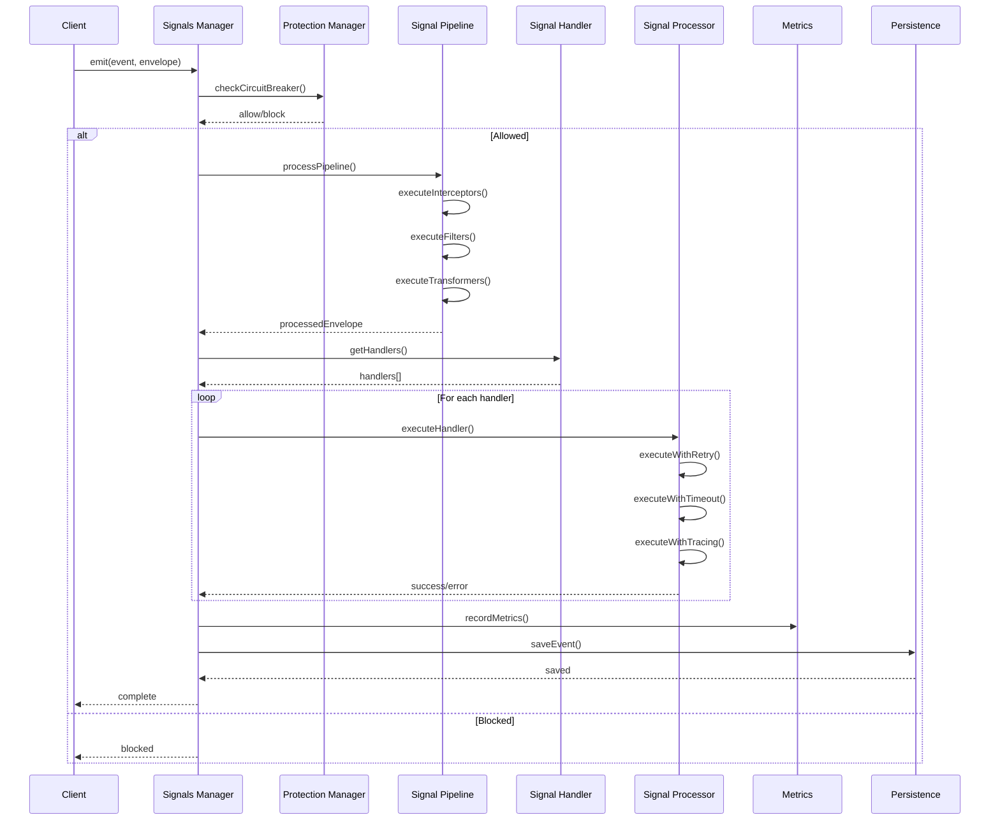
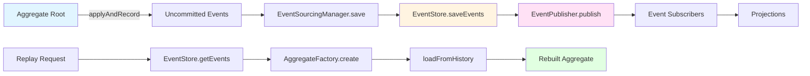

<div align="center">

# 🌺 Hibiscus Signal

[](LICENSE)
[](https://mvnrepository.com/artifact/io.github.heathcetide/cetide.hibiscus.signal)
[](https://www.oracle.com/java/)
[](https://github.com/Hibiscus-Tool/hibiscus-signal)
[](https://github.com/Hibiscus-Tool/hibiscus-signal/fork)

**English** | [中文 (README_CN.md)](README_CN.md)

**A robust, feature-rich event-driven framework for Java applications**

[Features](#features) • [Quick Start](#quick-start) • [Documentation](#usage-examples) • [Contributing](#contributing)

</div>

---

## Overview

**Hibiscus Signal** is a robust, feature-rich event-driven framework designed for Java applications. It provides a flexible and scalable way to manage signals, events, and handlers with advanced features such as interceptors, filters, transformers, circuit breakers, rate limiting, event sourcing, and transaction support.

### ✨ Why Choose Hibiscus Signal?

- 🚀 **High Performance**: Built for high-throughput event processing
- 🔒 **Enterprise Ready**: Transaction support, dead letter queues, and comprehensive error handling
- 📈 **Observable**: Built-in metrics, tracing, and monitoring capabilities
- 🛡️ **Resilient**: Circuit breakers and rate limiters protect your system
- 🔄 **Event Sourcing**: Full support for event sourcing patterns
- 🌱 **Spring Boot Native**: Seamless integration with Spring Boot ecosystem
- 💾 **Multiple Persistence**: File, Redis, Database, and Message Queue support
- 🎯 **Type Safe**: Generic type support for compile-time safety

---

## Features

### 🚀 Core Features

- **Event-Driven Architecture**: Asynchronous and synchronous signal processing
- **Spring Boot Integration**: Zero-configuration auto-configuration with Spring Boot
- **Flexible Handler Registration**: Multiple ways to register handlers (annotations, programmatic)
- **Priority-Based Processing**: Support for HIGH, MEDIUM, and LOW priority levels
- **Pipeline Processing**: Interceptors, filters, and transformers for signal processing

### 🛡️ Protection Mechanisms

- **Circuit Breaker**: Automatic circuit breaker with CLOSED/OPEN/HALF_OPEN states
- **Rate Limiting**: Sliding window rate limiter to prevent overload
- **Configurable Thresholds**: Customizable failure thresholds and error rates

### 💾 Persistence Options

- **File Persistence**: Incremental file-based storage
- **Redis Persistence**: High-performance Redis storage with TTL support
- **Database Persistence**: JPA-based database storage with automatic cleanup
- **Message Queue Persistence**: Support for RabbitMQ and Kafka

### 📊 Monitoring & Tracing

- **Metrics Collection**: Track emit counts, processing times, error rates
- **Request Tracing**: Built-in span-based tracing system
- **Context Propagation**: Thread-local context propagation using Transmittable Thread Local

### 🔄 Event Sourcing

- **Aggregate Root Support**: Full event sourcing pattern implementation
- **Event Store**: Database-backed event store
- **Event Replay**: Rebuild aggregates from event history
- **Event Versioning**: Optimistic locking with version control

### 🔐 Transaction Support

- **Isolated Transactions**: Each event processed in its own transaction
- **Retry Mechanism**: Exponential backoff with jitter for failed events
- **Dead Letter Queue**: Automatic handling of failed events after retries
- **Transaction Management**: Integration with Spring Transaction Manager

---

## Quick Start

### Maven Dependency

```xml
<dependency>
    <groupId>io.github.heathcetide</groupId>
    <artifactId>cetide.hibiscus.signal</artifactId>
    <version>1.1.0</version>
</dependency>
```

### Gradle Dependency

```gradle
implementation 'io.github.heathcetide:cetide.hibiscus.signal:1.1.0'
```

### Basic Configuration

Add to your `application.yml`:

```yaml
hibiscus:
  persistent: true
  persistence-methods:
    - file
    - redis
    - db
  redis-enabled: true
  redis-host: localhost
  redis-port: 6379
  database-persistent: true
  database-table-name: signal_events
  protection-enabled: true
  circuit-breaker-failure-threshold: 5
  rate-limiter-max-requests-per-second: 1000
  transaction-enabled: true
```

---

## Usage Examples

### 1. Using Annotations (Recommended)

#### Emit Signals

```java
import io.github.signal.spring.anno.SignalEmitter;
import org.springframework.stereotype.Service;

@Service
public class OrderService {
    
    @SignalEmitter("order.created")
    public Order createOrder(String userId, String productId) {
        Order order = new Order(userId, productId);
        // ... save order logic
        return order; // This will trigger the signal emission
    }
}
```

#### Handle Signals

```java
import io.github.signal.spring.anno.SignalHandler;
import io.github.signal.core.model.SignalContext;
import org.springframework.stereotype.Service;

@Service
public class NotificationService {
    
    @SignalHandler(
        value = "order.created",
        target = NotificationService.class,
        methodName = "sendOrderConfirmation",
        async = true,
        maxRetries = 3,
        timeoutMs = 5000,
        priority = SignalPriority.HIGH
    )
    public void sendOrderConfirmation(SignalContext context) {
        String userId = (String) context.getAttribute("userId");
        String orderId = (String) context.getAttribute("result");
        
        // Send notification email
        emailService.sendConfirmationEmail(userId, orderId);
    }
}
```

### 2. Programmatic Usage

```java
import io.github.signal.core.Signals;
import io.github.signal.core.SignalHandler;
import io.github.signal.core.config.SignalConfig;
import io.github.signal.core.model.Envelope;
import io.github.signal.core.model.SignalContext;
import org.springframework.beans.factory.annotation.Autowired;
import org.springframework.stereotype.Component;

@Component
public class OrderProcessor {
    
    @Autowired
    private Signals<Object, Object> signals;
    
    public void initialize() {
        // Register handler
        SignalConfig config = SignalConfig.builder()
            .async(true)
            .maxRetries(3)
            .timeoutMs(5000)
            .priority(SignalPriority.HIGH)
            .recordMetrics(true)
            .build();
            
        signals.connect("order.created", 
            (Envelope<Object, Object> envelope) -> {
                SignalContext context = envelope.getContext();
                String orderId = (String) context.getAttribute("orderId");
                processOrder(orderId);
            }, 
            config
        );
    }
    
    public void emitOrderCreated(Order order) {
        SignalContext context = new SignalContext();
        context.initTrace("order.created");
        context.setAttribute("orderId", order.getId());
        context.setAttribute("userId", order.getUserId());
        
        signals.emit("order.created",
            Envelope.Builder.builder()
                .payload(order)
                .context(context)
                .sender(this)
                .build(),
            (Throwable error) -> {
                // Error handling
                log.error("Failed to emit signal", error);
            }
        );
    }
}
```

### 3. Filters, Interceptors, and Transformers

#### Filter Example

```java
import io.github.signal.core.SignalFilter;
import io.github.signal.core.model.Envelope;
import org.springframework.stereotype.Component;

@Component
public class OrderValidationFilter implements SignalFilter<Object, Object> {
    
    @Override
    public boolean filter(String event, Envelope<Object, Object> envelope) {
        SignalContext context = envelope.getContext();
        String userId = (String) context.getAttribute("userId");
        
        // Only process orders from active users
        return userService.isUserActive(userId);
    }
    
    @Override
    public int getPriority() {
        return 100; // Lower number = higher priority
    }
}

// Register the filter
signals.addFilter("order.created", orderValidationFilter);
```

#### Interceptor Example

```java
import io.github.signal.core.SignalInterceptor;
import io.github.signal.core.model.Envelope;
import org.springframework.stereotype.Component;

@Component
public class LoggingInterceptor implements SignalInterceptor<Object, Object> {
    
    @Override
    public boolean beforeHandle(String event, Envelope<Object, Object> envelope) {
        log.info("Processing signal: {}", event);
        return true; // Continue processing
    }
    
    @Override
    public void afterHandle(String event, Envelope<Object, Object> envelope, Throwable error) {
        if (error != null) {
            log.error("Signal processing failed: {}", event, error);
        } else {
            log.info("Signal processed successfully: {}", event);
        }
    }
}

// Register the interceptor
signals.addSignalInterceptor("order.created", loggingInterceptor);
```

#### Transformer Example

```java
import io.github.signal.core.SignalTransformer;
import io.github.signal.core.model.Envelope;
import org.springframework.stereotype.Component;

@Component
public class OrderEnrichmentTransformer implements SignalTransformer<Object, Object> {
    
    @Override
    public Envelope<Object, Object> transform(String event, Envelope<Object, Object> envelope) {
        SignalContext context = envelope.getContext();
        
        // Enrich context with additional data
        String orderId = (String) context.getAttribute("orderId");
        OrderDetails details = orderService.getOrderDetails(orderId);
        context.setAttribute("orderDetails", details);
        
        return envelope;
    }
}

// Register the transformer
signals.addSignalTransformer("order.created", orderEnrichmentTransformer);
```

### 4. Event Sourcing Example

```java
import io.github.signal.core.eventsourcing.AggregateRoot;
import io.github.signal.core.eventsourcing.Event;
import io.github.signal.core.eventsourcing.EventSourcingManager;
import org.springframework.beans.factory.annotation.Autowired;

public class OrderAggregate extends AggregateRoot {
    
    private String orderId;
    private String status;
    private BigDecimal total;
    
    @Autowired
    private EventSourcingManager eventSourcingManager;
    
    public OrderAggregate(String id) {
        super(id, 0);
    }
    
    public void createOrder(String userId, List<OrderItem> items) {
        OrderCreatedEvent event = new OrderCreatedEvent(userId, items);
        applyAndRecord(event);
    }
    
    public void updateStatus(String newStatus) {
        OrderStatusUpdatedEvent event = new OrderStatusUpdatedEvent(newStatus);
        applyAndRecord(event);
    }
    
    @Override
    protected void apply(Event event) {
        if (event instanceof OrderCreatedEvent) {
            OrderCreatedEvent e = (OrderCreatedEvent) event;
            this.orderId = e.getOrderId();
            this.status = "CREATED";
            this.total = e.getTotal();
        } else if (event instanceof OrderStatusUpdatedEvent) {
            OrderStatusUpdatedEvent e = (OrderStatusUpdatedEvent) event;
            this.status = e.getNewStatus();
        }
    }
    
    public void save() {
        eventSourcingManager.save(this).join();
    }
}
```

### 5. Transaction Support

```java
import io.github.signal.core.config.SignalConfig;
import io.github.signal.core.config.TransactionConfig;
import org.springframework.transaction.TransactionDefinition;

// Configure transaction-enabled signal
TransactionConfig transactionConfig = TransactionConfig.builder()
    .enableTransaction(true)
    .enableRetry(true)
    .maxRetries(3)
    .retryDelayMs(1000)
    .enableExponentialBackoff(true)
    .enableJitter(true)
    .isolationLevel(TransactionDefinition.ISOLATION_READ_COMMITTED)
    .propagationBehavior(TransactionDefinition.PROPAGATION_REQUIRES_NEW)
    .build();

SignalConfig signalConfig = SignalConfig.builder()
    .async(true)
    .transactionConfig(transactionConfig)
    .build();

signals.connect("order.processed", handler, signalConfig);
```

---

## Configuration Reference

### Application Properties

```yaml
hibiscus:
  # Persistence Configuration
  persistent: true                          # Enable persistence
  persistence-methods:                      # Methods: file, redis, db, mq
    - file
    - redis
    - db
  persistence-file: "signal.json"           # File persistence path
  
  # Redis Configuration
  redis-enabled: true
  redis-host: localhost
  redis-port: 6379
  redis-password: ""
  redis-database: 0
  redis-expire-seconds: 86400             # TTL in seconds
  
  # Database Configuration
  database-persistent: true
  database-table-name: signal_events
  database-retention-days: 7
  enable-database-cleanup: true
  
  # MQ Configuration
  mq-enabled: true
  mq-type: rabbitmq                        # rabbitmq, kafka
  mq-host: localhost
  mq-port: 5672
  mq-username: guest
  mq-password: guest
  mq-virtual-host: /
  
  # Protection Configuration
  protection-enabled: true
  circuit-breaker-failure-threshold: 5
  circuit-breaker-open-timeout-ms: 60000
  circuit-breaker-half-open-trial-count: 3
  circuit-breaker-error-rate-threshold: 0.5
  rate-limiter-max-requests-per-second: 1000
  
  # Transaction Configuration
  transaction-enabled: true
  transaction:
    enable-retry: true
    max-retries: 3
    retry-delay-ms: 1000
    max-retry-delay-ms: 60000
    enable-exponential-backoff: true
    enable-jitter: true
    isolation-level: 2                     # READ_COMMITTED
    propagation-behavior: 3                # REQUIRES_NEW
  
  # Dead Letter Queue Configuration
  dead-letter:
    max-events: 10000
    retention-days: 30
    enable-auto-cleanup: true
```

---

## API Reference

### Core Classes

#### Signals

Main entry point for signal management.

```java
// Register handler
long handlerId = signals.connect(String event, SignalHandler<S, T> handler);
long handlerId = signals.connect(String event, SignalHandler<S, T> handler, SignalConfig config);

// Emit signal
signals.emit(String event, Envelope<S, T> envelope, Consumer<Throwable> errorHandler);
signals.emit(String event, Envelope<S, T> envelope, SignalCallback<S, T> callback, Consumer<Throwable> errorHandler);

// Unregister handler
signals.disconnect(String event, long handlerId);

// Get metrics
SignalMetrics metrics = signals.getMetrics();
```

#### SignalConfig

Configuration for signal processing.

```java
SignalConfig config = SignalConfig.builder()
    .async(true)                           // Async execution
    .maxRetries(3)                         // Max retry attempts
    .retryDelayMs(1000)                    // Retry delay
    .timeoutMs(5000)                       // Timeout in milliseconds
    .maxHandlers(10)                       // Max concurrent handlers
    .priority(SignalPriority.HIGH)         // Priority level
    .recordMetrics(true)                   // Enable metrics
    .transactionConfig(transactionConfig)   // Transaction config
    .build();
```

#### SignalContext

Context information for signal processing.

```java
SignalContext context = new SignalContext();
context.initTrace("event.name");
context.setAttribute("key", value);
Object value = context.getAttribute("key");
List<SignalContext.Span> spans = context.getSpans();
```

---

## Architecture

### Component Diagram

```mermaid
graph TB
    Signals[Signals<br/>Main Manager]
    
    Signals --> Registry[SignalRegistry<br/>Handler Management]
    Signals --> Pipeline[SignalPipeline<br/>Processing Chain]
    Signals --> Emitter[SignalEmitter<br/>Signal Dispatch]
    
    Registry --> Handler[SignalHandler<br/>Event Handlers]
    Pipeline --> Interceptor[SignalInterceptor<br/>Pre/Post Processing]
    Pipeline --> Filter[SignalFilter<br/>Validation]
    Pipeline --> Transformer[SignalTransformer<br/>Data Transformation]
    Emitter --> Processor[SignalProcessor<br/>Execution Engine]
    
    Processor --> Retry[Retry Logic]
    Processor --> Timeout[Timeout Handling]
    Processor --> Tracing[Tracing System]
    
    Signals --> Protection[SignalProtectionManager<br/>Circuit Breaker & Rate Limiter]
    Signals --> Metrics[SignalMetrics<br/>Monitoring]
    Signals --> Persistence[UnifiedSignalPersistence<br/>Storage Layer]
    
    Persistence --> FilePersistence[File Persistence]
    Persistence --> RedisPersistence[Redis Persistence]
    Persistence --> DBPersistence[Database Persistence]
    Persistence --> MQPersistence[Message Queue]
    
    Signals --> Transaction[EventTransactionManager<br/>Transaction Support]
    Transaction --> DLQ[DeadLetterQueueManager<br/>Failed Event Handling]
    
    Signals --> EventSourcing[EventSourcingManager<br/>Event Sourcing]
    EventSourcing --> EventStore[EventStore<br/>Event Storage]
    EventSourcing --> Aggregate[AggregateRoot<br/>Domain Model]
    
    style Signals fill:#e1f5ff
    style Registry fill:#fff4e1
    style Pipeline fill:#fff4e1
    style Emitter fill:#fff4e1
    style Protection fill:#ffe1f5
    style Metrics fill:#e1ffe1
    style Persistence fill:#f5e1ff
```



### Signal Processing Flow



### Event Sourcing Flow



---

## Best Practices

1. **Use Annotations for Simple Cases**: Annotations provide a clean, declarative way to define signal handlers.

2. **Configure Proper Timeouts**: Always set appropriate timeouts to prevent hanging operations.

3. **Enable Metrics for Production**: Metrics help monitor system health and performance.

4. **Use Priority Levels Wisely**: Assign HIGH priority only to critical operations.

5. **Implement Error Handlers**: Always provide error handlers for signal emission.

6. **Use Filters for Validation**: Use filters to validate signals before processing.

7. **Enable Circuit Breakers**: Protect your system from cascading failures.

8. **Monitor Dead Letter Queue**: Regularly check and process dead letter events.

9. **Use Event Sourcing Carefully**: Event sourcing adds complexity but provides audit trails and replay capabilities.

10. **Test Transaction Handling**: Ensure transaction boundaries are correctly configured.

---

## Troubleshooting

### Common Issues

**Issue**: Signals not being processed
- Check if handlers are registered correctly
- Verify event names match exactly
- Check if filters are blocking signals

**Issue**: High memory usage
- Reduce `eventTraces` retention in SignalMetrics
- Enable database cleanup for persistence
- Check for memory leaks in handlers

**Issue**: Transaction rollbacks
- Check transaction configuration
- Verify database connectivity
- Review dead letter queue for failed events

---

## Contributing

Contributions are welcome! Please feel free to submit a Pull Request.

1. Fork the repository from [Hibiscus-Tool/hibiscus-signal](https://github.com/Hibiscus-Tool/hibiscus-signal)
2. Create your feature branch (`git checkout -b feature/AmazingFeature`)
3. Commit your changes (`git commit -m 'Add some AmazingFeature'`)
4. Push to the branch (`git push origin feature/AmazingFeature`)
5. Open a Pull Request

### Development Guidelines

- Follow the existing code style
- Add tests for new features
- Update documentation as needed
- Ensure all tests pass before submitting

---

## License

This project is licensed under the Apache License 2.0 - see the [LICENSE](LICENSE) file for details.

---

## Support

- **Issues**: [GitHub Issues](https://github.com/Hibiscus-Tool/hibiscus-signal/issues)
- **Email**: 19511899044@163.com
- **GitHub**: [Hibiscus-Tool](https://github.com/Hibiscus-Tool)
- **Repository**: [hibiscus-signal](https://github.com/Hibiscus-Tool/hibiscus-signal)

---

## Acknowledgments

- Spring Framework team for excellent Spring Boot integration
- Apache Software Foundation for the Apache License

---


