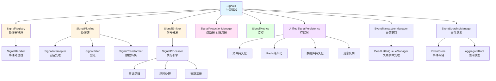
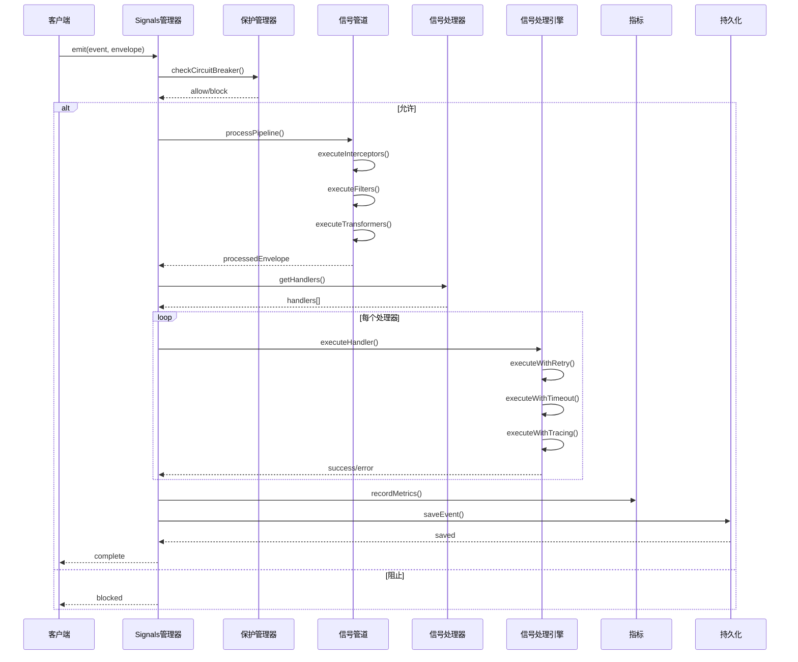
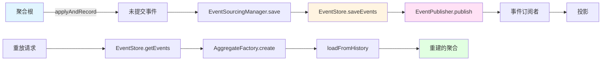

<div align="center">

# 🌺 Hibiscus Signal

[](LICENSE)
[](https://mvnrepository.com/artifact/io.github.heathcetide/cetide.hibiscus.signal)
[](https://www.oracle.com/java/)
[](https://github.com/Hibiscus-Tool/hibiscus-signal)
[](https://github.com/Hibiscus-Tool/hibiscus-signal/fork)

[English (README.md)](README.md) | **中文**

**一个功能强大、特性丰富的事件驱动框架，专为 Java 应用程序设计**

[特性](#特性) • [快速开始](#快速开始) • [文档](#使用示例) • [贡献](#贡献)

</div>

---

## 概述

**Hibiscus Signal** 是一个功能强大、特性丰富的事件驱动框架，专为 Java 应用程序设计。它提供了灵活且可扩展的方式来管理信号、事件和处理程序，具有拦截器、过滤器、转换器、熔断器、限流、事件溯源和事务支持等高级功能。

### ✨ 为什么选择 Hibiscus Signal？

- 🚀 **高性能**：专为高吞吐量事件处理而构建
- 🔒 **企业级**：事务支持、死信队列和全面的错误处理
- 📈 **可观测性**：内置指标、追踪和监控能力
- 🛡️ **弹性**：熔断器和限流器保护您的系统
- 🔄 **事件溯源**：完整支持事件溯源模式
- 🌱 **Spring Boot 原生**：与 Spring Boot 生态系统无缝集成
- 💾 **多种持久化**：支持文件、Redis、数据库和消息队列
- 🎯 **类型安全**：泛型类型支持，编译时安全

---

## 特性

### 🚀 核心功能

- **事件驱动架构**：支持异步和同步信号处理
- **Spring Boot 集成**：零配置自动配置，与 Spring Boot 完美集成
- **灵活的处理器注册**：多种方式注册处理器（注解、编程式）
- **基于优先级的处理**：支持 HIGH、MEDIUM 和 LOW 三个优先级级别
- **管道处理**：拦截器、过滤器和转换器用于信号处理

### 🛡️ 保护机制

- **熔断器**：自动熔断器，支持 CLOSED/OPEN/HALF_OPEN 状态
- **限流器**：滑动窗口限流器，防止系统过载
- **可配置阈值**：可自定义失败阈值和错误率

### 💾 持久化选项

- **文件持久化**：基于文件的增量存储
- **Redis 持久化**：高性能 Redis 存储，支持 TTL
- **数据库持久化**：基于 JPA 的数据库存储，支持自动清理
- **消息队列持久化**：支持 RabbitMQ 和 Kafka

### 📊 监控与追踪

- **指标收集**：跟踪发射次数、处理时间、错误率
- **请求追踪**：内置基于 Span 的追踪系统
- **上下文传播**：使用 Transmittable Thread Local 进行线程本地上下文传播

### 🔄 事件溯源

- **聚合根支持**：完整的事件溯源模式实现
- **事件存储**：基于数据库的事件存储
- **事件重放**：从事件历史重建聚合
- **事件版本控制**：支持乐观锁的版本控制

### 🔐 事务支持

- **隔离事务**：每个事件在独立事务中处理
- **重试机制**：指数退避和抖动策略处理失败事件
- **死信队列**：重试失败后自动处理死信事件
- **事务管理**：与 Spring 事务管理器集成

---

## 快速开始

### Maven 依赖

```xml
<dependency>
    <groupId>io.github.heathcetide</groupId>
    <artifactId>cetide.hibiscus.signal</artifactId>
    <version>1.1.0</version>
</dependency>
```

### Gradle 依赖

```gradle
implementation 'io.github.heathcetide:cetide.hibiscus.signal:1.1.0'
```

### 基本配置

在 `application.yml` 中添加：

```yaml
hibiscus:
  persistent: true
  persistence-methods:
    - file
    - redis
    - db
  redis-enabled: true
  redis-host: localhost
  redis-port: 6379
  database-persistent: true
  database-table-name: signal_events
  protection-enabled: true
  circuit-breaker-failure-threshold: 5
  rate-limiter-max-requests-per-second: 1000
  transaction-enabled: true
```

---

## 使用示例

### 1. 使用注解方式（推荐）

#### 发射信号

```java
import io.github.signal.spring.anno.SignalEmitter;
import org.springframework.stereotype.Service;

@Service
public class OrderService {
    
    @SignalEmitter("order.created")
    public Order createOrder(String userId, String productId) {
        Order order = new Order(userId, productId);
        // ... 保存订单逻辑
        return order; // 这将触发信号发射
    }
}
```

#### 处理信号

```java
import io.github.signal.spring.anno.SignalHandler;
import io.github.signal.core.model.SignalContext;
import io.github.signal.core.enums.SignalPriority;
import org.springframework.stereotype.Service;

@Service
public class NotificationService {
    
    @SignalHandler(
        value = "order.created",
        target = NotificationService.class,
        methodName = "sendOrderConfirmation",
        async = true,
        maxRetries = 3,
        timeoutMs = 5000,
        priority = SignalPriority.HIGH
    )
    public void sendOrderConfirmation(SignalContext context) {
        String userId = (String) context.getAttribute("userId");
        String orderId = (String) context.getAttribute("result");
        
        // 发送通知邮件
        emailService.sendConfirmationEmail(userId, orderId);
    }
}
```

### 2. 编程式使用

```java
import io.github.signal.core.Signals;
import io.github.signal.core.SignalHandler;
import io.github.signal.core.config.SignalConfig;
import io.github.signal.core.model.Envelope;
import io.github.signal.core.model.SignalContext;
import io.github.signal.core.enums.SignalPriority;
import org.springframework.beans.factory.annotation.Autowired;
import org.springframework.stereotype.Component;

@Component
public class OrderProcessor {
    
    @Autowired
    private Signals<Object, Object> signals;
    
    public void initialize() {
        // 注册处理器
        SignalConfig config = SignalConfig.builder()
            .async(true)
            .maxRetries(3)
            .timeoutMs(5000)
            .priority(SignalPriority.HIGH)
            .recordMetrics(true)
            .build();
            
        signals.connect("order.created", 
            (Envelope<Object, Object> envelope) -> {
                SignalContext context = envelope.getContext();
                String orderId = (String) context.getAttribute("orderId");
                processOrder(orderId);
            }, 
            config
        );
    }
    
    public void emitOrderCreated(Order order) {
        SignalContext context = new SignalContext();
        context.initTrace("order.created");
        context.setAttribute("orderId", order.getId());
        context.setAttribute("userId", order.getUserId());
        
        signals.emit("order.created",
            Envelope.Builder.builder()
                .payload(order)
                .context(context)
                .sender(this)
                .build(),
            (Throwable error) -> {
                // 错误处理
                log.error("信号发射失败", error);
            }
        );
    }
}
```

### 3. 过滤器、拦截器和转换器

#### 过滤器示例

```java
import io.github.signal.core.SignalFilter;
import io.github.signal.core.model.Envelope;
import org.springframework.stereotype.Component;

@Component
public class OrderValidationFilter implements SignalFilter<Object, Object> {
    
    @Override
    public boolean filter(String event, Envelope<Object, Object> envelope) {
        SignalContext context = envelope.getContext();
        String userId = (String) context.getAttribute("userId");
        
        // 只处理活跃用户的订单
        return userService.isUserActive(userId);
    }
    
    @Override
    public int getPriority() {
        return 100; // 数字越小优先级越高
    }
}

// 注册过滤器
signals.addFilter("order.created", orderValidationFilter);
```

#### 拦截器示例

```java
import io.github.signal.core.SignalInterceptor;
import io.github.signal.core.model.Envelope;
import org.springframework.stereotype.Component;

@Component
public class LoggingInterceptor implements SignalInterceptor<Object, Object> {
    
    @Override
    public boolean beforeHandle(String event, Envelope<Object, Object> envelope) {
        log.info("正在处理信号: {}", event);
        return true; // 继续处理
    }
    
    @Override
    public void afterHandle(String event, Envelope<Object, Object> envelope, Throwable error) {
        if (error != null) {
            log.error("信号处理失败: {}", event, error);
        } else {
            log.info("信号处理成功: {}", event);
        }
    }
}

// 注册拦截器
signals.addSignalInterceptor("order.created", loggingInterceptor);
```

#### 转换器示例

```java
import io.github.signal.core.SignalTransformer;
import io.github.signal.core.model.Envelope;
import org.springframework.stereotype.Component;

@Component
public class OrderEnrichmentTransformer implements SignalTransformer<Object, Object> {
    
    @Override
    public Envelope<Object, Object> transform(String event, Envelope<Object, Object> envelope) {
        SignalContext context = envelope.getContext();
        
        // 丰富上下文数据
        String orderId = (String) context.getAttribute("orderId");
        OrderDetails details = orderService.getOrderDetails(orderId);
        context.setAttribute("orderDetails", details);
        
        return envelope;
    }
}

// 注册转换器
signals.addSignalTransformer("order.created", orderEnrichmentTransformer);
```

### 4. 事件溯源示例

```java
import io.github.signal.core.eventsourcing.AggregateRoot;
import io.github.signal.core.eventsourcing.Event;
import io.github.signal.core.eventsourcing.EventSourcingManager;
import org.springframework.beans.factory.annotation.Autowired;
import java.math.BigDecimal;
import java.util.List;

public class OrderAggregate extends AggregateRoot {
    
    private String orderId;
    private String status;
    private BigDecimal total;
    
    @Autowired
    private EventSourcingManager eventSourcingManager;
    
    public OrderAggregate(String id) {
        super(id, 0);
    }
    
    public void createOrder(String userId, List<OrderItem> items) {
        OrderCreatedEvent event = new OrderCreatedEvent(userId, items);
        applyAndRecord(event);
    }
    
    public void updateStatus(String newStatus) {
        OrderStatusUpdatedEvent event = new OrderStatusUpdatedEvent(newStatus);
        applyAndRecord(event);
    }
    
    @Override
    protected void apply(Event event) {
        if (event instanceof OrderCreatedEvent) {
            OrderCreatedEvent e = (OrderCreatedEvent) event;
            this.orderId = e.getOrderId();
            this.status = "CREATED";
            this.total = e.getTotal();
        } else if (event instanceof OrderStatusUpdatedEvent) {
            OrderStatusUpdatedEvent e = (OrderStatusUpdatedEvent) event;
            this.status = e.getNewStatus();
        }
    }
    
    public void save() {
        eventSourcingManager.save(this).join();
    }
}
```

### 5. 事务支持

```java
import io.github.signal.core.config.SignalConfig;
import io.github.signal.core.config.TransactionConfig;
import org.springframework.transaction.TransactionDefinition;

// 配置启用事务的信号
TransactionConfig transactionConfig = TransactionConfig.builder()
    .enableTransaction(true)
    .enableRetry(true)
    .maxRetries(3)
    .retryDelayMs(1000)
    .enableExponentialBackoff(true)
    .enableJitter(true)
    .isolationLevel(TransactionDefinition.ISOLATION_READ_COMMITTED)
    .propagationBehavior(TransactionDefinition.PROPAGATION_REQUIRES_NEW)
    .build();

SignalConfig signalConfig = SignalConfig.builder()
    .async(true)
    .transactionConfig(transactionConfig)
    .build();

signals.connect("order.processed", handler, signalConfig);
```

---

## 配置参考

### 应用配置属性

```yaml
hibiscus:
  # 持久化配置
  persistent: true                          # 启用持久化
  persistence-methods:                      # 方法: file, redis, db, mq
    - file
    - redis
    - db
  persistence-file: "signal.json"           # 文件持久化路径
  
  # Redis 配置
  redis-enabled: true
  redis-host: localhost
  redis-port: 6379
  redis-password: ""
  redis-database: 0
  redis-expire-seconds: 86400             # TTL（秒）
  
  # 数据库配置
  database-persistent: true
  database-table-name: signal_events
  database-retention-days: 7
  enable-database-cleanup: true
  
  # 消息队列配置
  mq-enabled: true
  mq-type: rabbitmq                        # rabbitmq, kafka
  mq-host: localhost
  mq-port: 5672
  mq-username: guest
  mq-password: guest
  mq-virtual-host: /
  
  # 保护机制配置
  protection-enabled: true
  circuit-breaker-failure-threshold: 5
  circuit-breaker-open-timeout-ms: 60000
  circuit-breaker-half-open-trial-count: 3
  circuit-breaker-error-rate-threshold: 0.5
  rate-limiter-max-requests-per-second: 1000
  
  # 事务配置
  transaction-enabled: true
  transaction:
    enable-retry: true
    max-retries: 3
    retry-delay-ms: 1000
    max-retry-delay-ms: 60000
    enable-exponential-backoff: true
    enable-jitter: true
    isolation-level: 2                     # READ_COMMITTED
    propagation-behavior: 3                # REQUIRES_NEW
  
  # 死信队列配置
  dead-letter:
    max-events: 10000
    retention-days: 30
    enable-auto-cleanup: true
```

---

## API 参考

### 核心类

#### Signals

信号管理的主要入口点。

```java
// 注册处理器
long handlerId = signals.connect(String event, SignalHandler<S, T> handler);
long handlerId = signals.connect(String event, SignalHandler<S, T> handler, SignalConfig config);

// 发射信号
signals.emit(String event, Envelope<S, T> envelope, Consumer<Throwable> errorHandler);
signals.emit(String event, Envelope<S, T> envelope, SignalCallback<S, T> callback, Consumer<Throwable> errorHandler);

// 注销处理器
signals.disconnect(String event, long handlerId);

// 获取指标
SignalMetrics metrics = signals.getMetrics();
```

#### SignalConfig

信号处理配置。

```java
SignalConfig config = SignalConfig.builder()
    .async(true)                           // 异步执行
    .maxRetries(3)                         // 最大重试次数
    .retryDelayMs(1000)                    // 重试延迟
    .timeoutMs(5000)                       // 超时时间（毫秒）
    .maxHandlers(10)                       // 最大并发处理器数
    .priority(SignalPriority.HIGH)         // 优先级级别
    .recordMetrics(true)                   // 启用指标
    .transactionConfig(transactionConfig)   // 事务配置
    .build();
```

#### SignalContext

信号处理上下文信息。

```java
SignalContext context = new SignalContext();
context.initTrace("event.name");
context.setAttribute("key", value);
Object value = context.getAttribute("key");
List<SignalContext.Span> spans = context.getSpans();
```

---

## 架构

### 组件图



### 信号处理流程



### 事件溯源流程



---

## 最佳实践

1. **简单场景使用注解**：注解提供了简洁、声明式的方式来定义信号处理器。

2. **配置合适的超时时间**：始终设置适当的超时时间以防止操作挂起。

3. **生产环境启用指标**：指标有助于监控系统健康状况和性能。

4. **明智使用优先级**：仅对关键操作分配 HIGH 优先级。

5. **实现错误处理器**：始终为信号发射提供错误处理器。

6. **使用过滤器进行验证**：使用过滤器在处理前验证信号。

7. **启用熔断器**：保护系统免受级联故障。

8. **监控死信队列**：定期检查和处理死信事件。

9. **谨慎使用事件溯源**：事件溯源增加了复杂性，但提供了审计跟踪和重放能力。

10. **测试事务处理**：确保事务边界配置正确。

---

## 故障排除

### 常见问题

**问题**：信号未被处理
- 检查处理器是否正确注册
- 验证事件名称是否完全匹配
- 检查过滤器是否阻止了信号

**问题**：内存使用过高
- 减少 SignalMetrics 中的 `eventTraces` 保留时间
- 为持久化启用数据库清理
- 检查处理器中是否存在内存泄漏

**问题**：事务回滚
- 检查事务配置
- 验证数据库连接
- 查看死信队列中的失败事件

---

## 贡献

欢迎贡献！请随时提交 Pull Request。

1. Fork 仓库从 [Hibiscus-Tool/hibiscus-signal](https://github.com/Hibiscus-Tool/hibiscus-signal)
2. 创建您的功能分支 (`git checkout -b feature/AmazingFeature`)
3. 提交您的更改 (`git commit -m '添加一些 AmazingFeature'`)
4. 推送到分支 (`git push origin feature/AmazingFeature`)
5. 打开 Pull Request

### 开发指南

- 遵循现有的代码风格
- 为新功能添加测试
- 根据需要更新文档
- 提交前确保所有测试通过

---

## 许可证

本项目采用 Apache License 2.0 许可证 - 详情请参阅 [LICENSE](LICENSE) 文件。

---

## 支持

- **问题反馈**：[GitHub Issues](https://github.com/Hibiscus-Tool/hibiscus-signal/issues)
- **邮箱**：19511899044@163.com
- **GitHub**：[Hibiscus-Tool](https://github.com/Hibiscus-Tool)
- **仓库地址**：[hibiscus-signal](https://github.com/Hibiscus-Tool/hibiscus-signal)

---

## 致谢

- Spring Framework 团队提供的优秀 Spring Boot 集成
- Apache Software Foundation 提供的 Apache License

---

